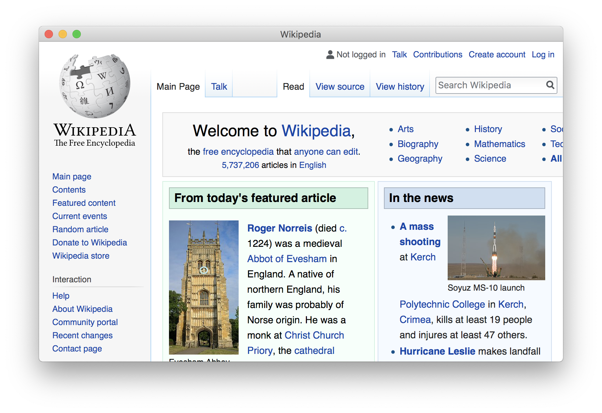

# [Deprecated] - webview.js
WebKit for macOS Catalina has **horrendous** font rendering. Please use Chromium or Firefox instead.

~~Electron without Chromium based on [webview](https://github.com/zserge/webview).~~

## Build
You need [node-gyp](https://github.com/nodejs/node-gyp), which requires Python
2.x and a C/C++ compiler toolchain like GCC. Run `yarn` under the project folder
then it will be built.

## Example
For examples to how to use this library, see files under `test` folder.

## License
[MIT License](LICENSE).
